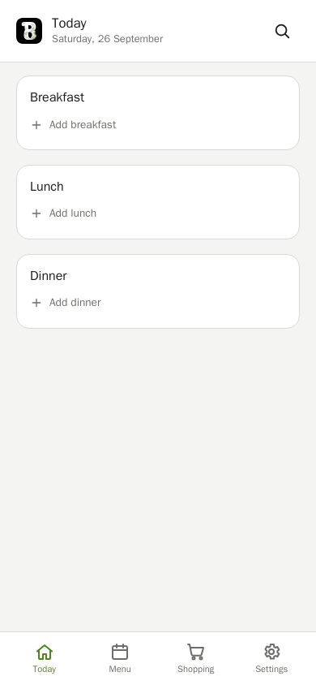
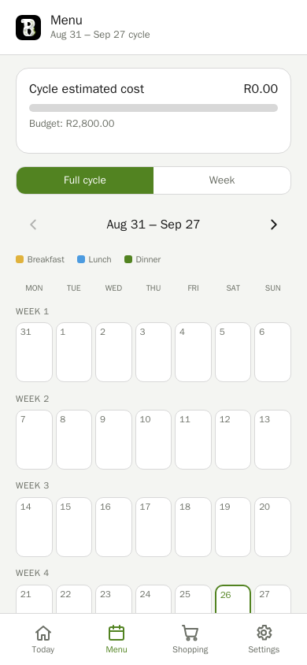
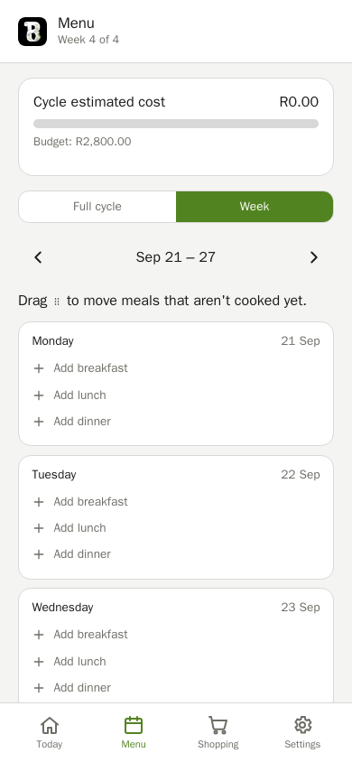
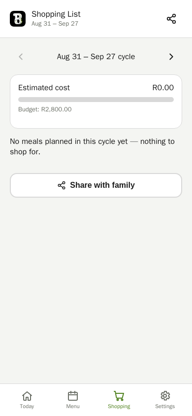
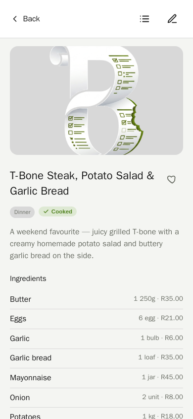
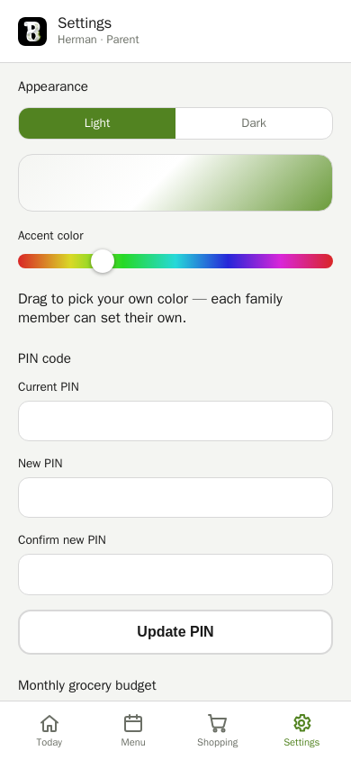

# BitsAndBytesMenuPlanner (B&B)

A mobile-first PWA for planning a family's monthly menu: what's for dinner
today, a full-cycle/weekly calendar, an auto-generated shopping list with
budget tracking, recipes with priced ingredients, favorites, and a place for
the family to suggest new meals. Plain PHP + SQLite, no framework, no build
step — install it to a phone's home screen and it just works.

The menu runs on a "cycle" rather than a calendar month: it starts the Monday
after the first shopping weekend following payday (the 25th) and runs until
the weekend that covers next month's 25th — matching how the family actually
shops and cooks.

## Screenshots

| Today | Full-cycle menu | Week view |
|---|---|---|
|  |  |  |

| Shopping list | Recipe | Settings |
|---|---|---|
|  |  |  |

## Features

- **Today / Calendar / Week** views of the current menu cycle, with prev/next
  navigation across cycles and weeks.
- **Recipes**: description, priced ingredients, step-by-step prep, optional
  photo. Searchable by name or ingredient.
- **Priced ingredient catalog** — every ingredient has a category, unit, and
  estimated price, so the shopping list and a live budget warning are always
  accurate.
- **Shopping list**, auto-aggregated from the current cycle's meals, grouped
  by category, with a per-cycle checklist and a share action.
- **Copy Cycle** — reuse a previous cycle's menu as the starting point for a
  new one (mapped week-by-week, repeating from week 1 if the new cycle runs
  longer).
- **Roles**: Parents can edit the menu, meals, and ingredients; Children can
  favorite meals and mark them cooked; Guests get a read-only view.
- **Per-user theme** (light/dark) and accent color.
- **Meal suggestions**: anyone can suggest a meal; Parents approve (adds it
  to the catalog) or dismiss.
- Installable as a PWA (manifest + service worker, home-screen icon,
  standalone launch).

## Running it

Requires Docker.

```bash
docker compose up -d
```

The app is then served at **http://localhost:8080**.

On first run, the database doesn't exist yet, so it's created automatically
along with a demo account:

| Email | PIN |
|---|---|
| `demo@example.com` | `1234` |

Log in with that, then use Settings to add the real family (each with their
own email/PIN/role) and change or remove the demo account once real Parents
exist. There's also a monthly budget pre-set to R2,000 — adjust it in
Settings, and a menu cycle already covering today so there's somewhere to
start planning right away.

## Development

`docker-compose.dev.yml` runs a throwaway Playwright container (joined to the
running app's network) for browser-driven checks and regression screenshots,
without installing anything on the host:

```bash
docker compose -f docker-compose.dev.yml run --rm playwright
```

Screenshots land in `tools/screenshots/` (gitignored). `src/scripts/seed.php`
resets the database to a small sample family/menu for local development —
run it (via `docker exec`) any time you want a clean, predictable dataset
instead of the bare demo account.

See [`PLAN.md`](PLAN.md) for the full build history and design decisions.

## License

MIT — see [`LICENSE`](LICENSE).
